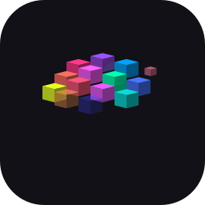
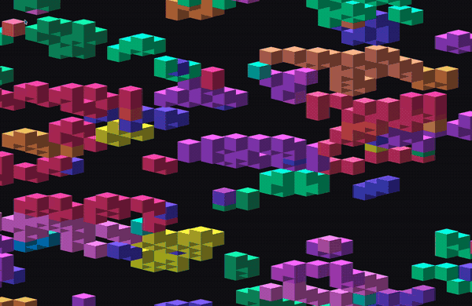
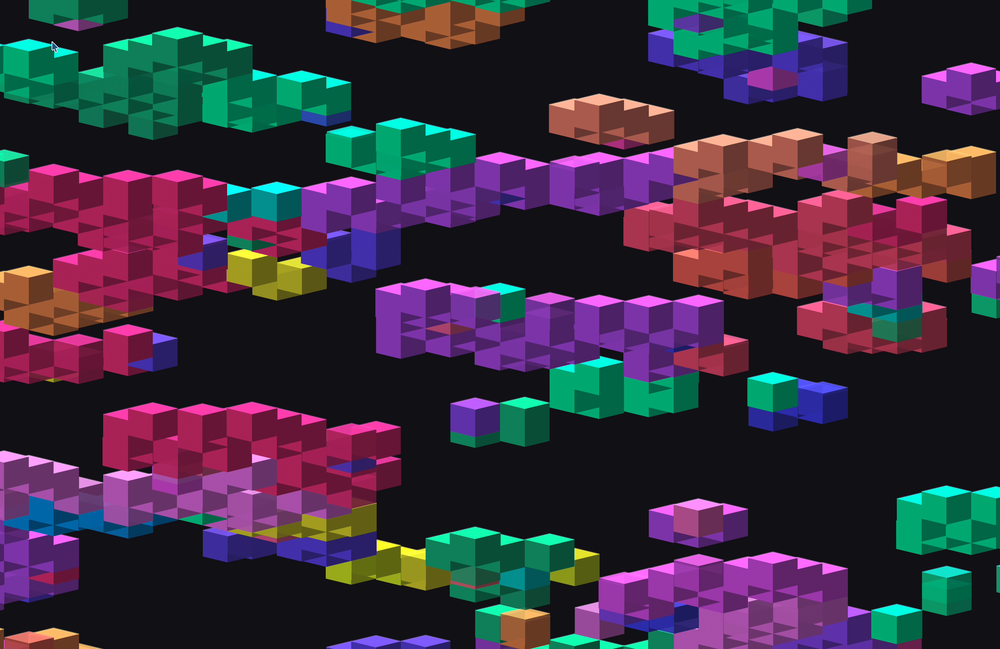

<p align="center">
  
</p>

<h1 align="center">LivingGlass</h1>

<p align="center">
  <b>Conway's Game of Life as a living, breathing macOS desktop wallpaper.</b><br/>
  Isometric 3D cubes · Metal GPU rendering · 60fps
</p>

<p align="center">
  
  
  
</p>

<p align="center">
  
</p>

---

## What is this?

LivingGlass turns your desktop into an endless, evolving Game of Life simulation. Colorful isometric cubes pop into existence, float gently, then shake loose and fall into the void when they die — all rendered at 60fps on your GPU while your CPU stays nearly idle.

It runs behind all your windows and stays out of your way.

<p align="center">
  
</p>

## Features

- **Isometric 3D cubes** — not a flat grid. Cubes have shaded faces, subtle floating animations, and a shallow viewing angle
- **Metal GPU rendering** — all drawing happens on the GPU via instanced rendering. CPU usage is near zero during normal operation
- **24-color palette** — newborn cells inherit their parents' colors with occasional mutations, so color regions drift and evolve organically
- **Smooth 60fps animations**
  - **Spawning:** cubes expand into existence with a satisfying overshoot bounce
  - **Alive:** gentle floating bob and breathing height oscillation
  - **Dying:** cubes vibrate with increasing intensity, tint red, then tumble and fall away
- **All monitors** — one window per display, auto-reconfigures when you plug in or unplug screens
- **Precomputed game states** — 1000 generations computed in a background batch, consumed 1 per tick. CPU wakes up for a burst every ~33 minutes
- **Stagnation detection** — if any board state repeats within 100 steps, new active patterns are injected
- **Low Power Mode aware** — freezes on the current frame when macOS Low Power Mode activates
- **Dynamic scaling** — adapts to your screen resolution, from 1080p to 8K
- **Menu bar app** — lives in your menu bar as 🧬, no dock icon

## Install

### Build from source

Requires macOS 14+ and Xcode Command Line Tools:

```bash
xcode-select --install
```

```bash
git clone https://github.com/taigrr/LivingGlass.git
cd LivingGlass
./build.sh
open "build/LivingGlass.app"
```

### Install permanently

```bash
cp -r "build/LivingGlass.app" /Applications/
```

### Start on login

System Settings → General → Login Items → **+** → select LivingGlass

## Configuration

Tweak constants in `Sources/GameOfLifeView.swift`:

| Constant | Default | What it does |
|----------|---------|-------------|
| `targetTilesAcross` | `20` | Tiles spanning screen width. Lower = bigger cubes |
| `gameTickEvery` | `120` | Frames between game steps (120 = 2s at 60fps) |

## Requirements

- macOS 14 (Sonoma) or later
- Metal-capable GPU (all Macs since 2012)
- Xcode Command Line Tools

## License

[0BSD](LICENSE)

---

<p align="center">
  <sub>Made with 🧬 by <a href="https://github.com/taigrr">Tai Groot</a></sub>
</p>
